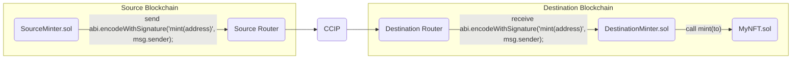

## Chainlink CCIP Starter Kit

> **Note**
>
> _This repository represents an example of using a Chainlink product or service. It is provided to help you understand how to interact with Chainlink’s systems so that you can integrate them into your own. This template is provided "AS IS" without warranties of any kind, has not been audited, and may be missing key checks or error handling to make the usage of the product more clear. Take everything in this repository as an example and not something to be copy pasted into a production ready service._

This project demonstrates a couple of basic Chainlink CCIP use cases.

## Prerequisites

- [Foundry](https://book.getfoundry.sh/getting-started/installation)

## Getting Started

1. Install packages

```
forge install
```

and

```
npm install
```

2. Compile contracts

```
forge build
```

## What is Chainlink CCIP?

**Chainlink Cross-Chain Interoperability Protocol (CCIP)** provides a single, simple, and elegant interface through which dApps and web3 entrepreneurs can securely meet all their cross-chain needs, including token transfers and arbitrary messaging.


With Chainlink CCIP, one can:

- Transfer supported tokens
- Send messages (any data)
- Send messages and tokens

CCIP receiver can be:

- Smart contract that implements `CCIPReceiver.sol`
- EOA

**Note**: If you send a message and token(s) to EOA, only tokens will arrive

To use this project, you can consider CCIP as a "black-box" component and be aware of the Router contract only. If you want to dive deep into it, check the [Official Chainlink Documentation](https://docs.chain.link/ccip).

## Usage

In the next section you can see a couple of basic Chainlink CCIP use case examples. But before that, you need to set up some environment variables.

Create a new file by copying the `.env.example` file, and name it `.env`. Fill in your wallet's PRIVATE_KEY, and RPC URLs for at least two blockchains

```shell
PRIVATE_KEY=""
ETHEREUM_SEPOLIA_RPC_URL=""
OPTIMISM_GOERLI_RPC_URL=""
AVALANCHE_FUJI_RPC_URL=""
ARBITRUM_TESTNET_RPC_URL=""
POLYGON_MUMBAI_RPC_URL=""
```

Once that is done, to load the variables in the `.env` file, run the following command:

```shell
source .env
```

Make yourself familiar with the [`Helper.sol`](./script/Helper.sol) smart contract. It contains all the necessary Chainlink CCIP config. If you ever need to adjust any of those parameters, go to the Helper contract.

This contract also contains some enums, like `SupportedNetworks`:

```solidity
enum SupportedNetworks {
    ETHEREUM_SEPOLIA,   // 0
    OPTIMISM_GOERLI,    // 1
    AVALANCHE_FUJI,     // 2
    ARBITRUM_GOERLI,    // 3
    POLYGON_MUMBAI      // 4
}
```

This means that if you want to perform some action from `AVALANCHE_FUJI` blockchain to `ETHEREUM_SEPOLIA` blockchain, for example, you will need to pass `2 (uint8)` as a source blockchain flag and `0 (uint8)` as a destination blockchain flag.

Similarly, there is an `PayFeesIn` enum:

```solidity
enum PayFeesIn {
    Native,  // 0
    LINK     // 1
}
```

So, if you want to pay for Chainlink CCIP fees in LINK token, you will pass `1 (uint8)` as a function argument.

### Faucet

You will need test tokens for some of the examples in this Starter Kit. Public faucets sometimes limit how many tokens a user can create and token pools might not have enough liquidity. To resolve these issues, CCIP supports two test tokens that you can mint permissionlessly so you don't run out of tokens while testing different scenarios.

To get 10\*\*18 units of each of these tokens, use the `script/Faucet.s.sol` smart contract. Keep in mind that the `CCIP-BnM` test token you can mint on all testnets, while `CCIP-LnM` you can mint only on Ethereum Sepolia. On other testnets, the `CCIP-LnM` token representation is a wrapped/synthetic asset called `clCCIP-LnM`.

```solidity
function run(SupportedNetworks network) external;
```

For example, to mint 10\*\*18 units of both `CCIP-BnM` and `CCIP-LnM` test tokens on Ethereum Sepolia, run:

```shell
forge script ./script/Faucet.s.sol -vvv --broadcast --rpc-url ethereumSepolia --sig "run(uint8)" -- 0
```

Or if you want to mint 10\*\*18 units of `CCIP-BnM` test token on Avalanche Fuji, run:

```shell
forge script ./script/Faucet.s.sol -vvv --broadcast --rpc-url avalancheFuji --sig "run(uint8)" -- 2
```

### Example 7 - Execute Received Message as a Function Call

Our goal for this example is to mint an NFT on the destination blockchain by sending the `to` address from the source blockchain. It is extremely simple so we can understand the basic concepts, but you can expand it to accept payment for minting on the source blockchain, add extra features, etc.

The basic architecture diagram of what we want to accomplish looks like this:



1. Deploy the [`MyNFT.sol`](./src/cross-chain-nft-minter/MyNFT.sol) and [`DestinationMinter.sol`](./src/cross-chain-nft-minter/DestinationMinter.sol) smart contracts from the `./src/cross-chain-nft-minter` folder on the **destination blockchain**, by using the `script/CrossChainNFT.s.sol:DeployDestination` smart contract:

```solidity
function run(SupportedNetworks destination) external;
```

For example, if you want to have an NFT collection on Ethereum Sepolia, run:

```shell
forge script ./script/CrossChainNFT.s.sol:DeployDestination -vvv --broadcast --rpc-url ethereumSepolia --sig "run(uint8)" -- 0
```

2. Deploy the [`SourceMinter.sol`](./src/cross-chain-nft-minter/SourceMinter.sol) smart contract on the **source blockchain**, by using the `script/CrossChainNFT.s.sol:DeploySource` smart contract:

```solidity
function run(SupportedNetworks source) external;
```

For example, if you want to mint NFTs on Ethereum Sepolia from Avalanche Fuji, run:

```shell
forge script ./script/CrossChainNFT.s.sol:DeploySource -vvv --broadcast --rpc-url avalancheFuji --sig "run(uint8)" -- 2
```

3. Fund the [`SourceMinter.sol`](./src/cross-chain-nft-minter/SourceMinter.sol) smart contract with tokens for CCIP fees.

- If you want to pay for CCIP fees in Native tokens:

  Open Metamask and fund your contract with Native tokens. For example, if you want to mint from Avalanche Fuji to Ethereum Sepolia, you can send 0.1 Fuji AVAX to the [`SourceMinter.sol`](./src/cross-chain-nft-minter/SourceMinter.sol) smart contract.

  Or, you can use the `cast send` command:

  ```shell
  cast send <SOURCE_MINTER_ADDRESS> --rpc-url avalancheFuji --private-key=$PRIVATE_KEY --value 0.1ether
  ```

- If you want to pay for CCIP fees in LINK tokens:

  Open Metamask and fund your contract with LINK tokens. For example, if you want to mint from Avalanche Fuji to Ethereum Sepolia, you can send 0.01 Fuji LINK to the [`SourceMinter.sol`](./src/cross-chain-nft-minter/SourceMinter.sol) smart contract.

  Or, you can use the `cast send` command:

  ```shell
  cast send 0x0b9d5D9136855f6FEc3c0993feE6E9CE8a297846 "transfer(address,uint256)" <SOURCE_MINTER_ADDRESS> 10000000000000000 --rpc-url avalancheFuji --private-key=$PRIVATE_KEY
  ```

4. Mint NFTs by calling the `mint()` function of the [`SourceMinter.sol`](./src/cross-chain-nft-minter/SourceMinter.sol) smart contract on the **source blockchain**. It will send the CCIP Cross-Chain Message with the ABI-encoded mint function signature from the [`MyNFT.sol`](./src/cross-chain-nft-minter/MyNFT.sol) smart contract. The [`DestinationMinter.sol`](./src/cross-chain-nft-minter/DestinationMinter.sol) smart contracts will receive the CCIP Cross-Chain Message with the ABI-encoded mint function signature as a payload and call the [`MyNFT.sol`](./src/cross-chain-nft-minter/MyNFT.sol) smart contract using it. The [`MyNFT.sol`](./src/cross-chain-nft-minter/MyNFT.sol) smart contract will then mint the new NFT to the `msg.sender` account from the `mint()` function of the [`SourceMinter.sol`](./src/cross-chain-nft-minter/SourceMinter.sol) smart contract, a.k.a to the account from which you will call the following command:

```solidity
function run(
    address payable sourceMinterAddress,
    SupportedNetworks destination,
    address destinationMinterAddress,
    SourceMinter.PayFeesIn payFeesIn
) external;
```

For example, if you want to mint NFTs on Ethereum Sepolia by sending requests from Avalanche Fuji, run:

```shell
forge script ./script/CrossChainNFT.s.sol:Mint -vvv --broadcast --rpc-url avalancheFuji --sig "run(a
ddress,uint8,address,uint8)" -- <SOURCE_MINTER_ADDRESS> 0 <DESTINATION_MINTER_ADDRESS> 0
```

5. Once the CCIP message is finalized on the destination blockchain, you can query the MyNFTs balance of your account, using the `cast call` command.


For example, to verify that the new MyNFT was minted, type:

```shell
cast call <MY_NFT_ADDRESS> "balanceOf(address)" <PUT_YOUR_ADDRESS_HERE> --rpc-url ethereumSepolia
```

Of course, you can see your newly minted NFT on popular NFT Marketplaces, like OpenSea for instance:


6. You can always withdraw tokens for Chainlink CCIP fees from the [`SourceMinter.sol`](./src/cross-chain-nft-minter/SourceMinter.sol) smart contract using the `cast send` command.

For example, to withdraw tokens previously sent for Chainlink CCIP fees, run:

```shell
cast send <SOURCE_MINTER_ADDRESS> --rpc-url avalancheFuji --private-key=$PRIVATE_KEY "withdraw(address)" <BENEFICIARY_ADDRESS>
```

or

```shell
cast send <SOURCE_MINTER_ADDRESS> --rpc-url avalancheFuji --private-key=$PRIVATE_KEY "withdrawToken(address,address)" <BENEFICIARY_ADDRESS> 0x0b9d5D9136855f6FEc3c0993feE6E9CE8a297846
```

depending on whether you filled the [`SourceMinter.sol`](./src/cross-chain-nft-minter/SourceMinter.sol) contract with `Native (0)` or `LINK (1)` in step number 3.
